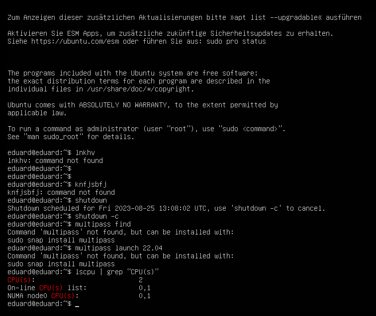
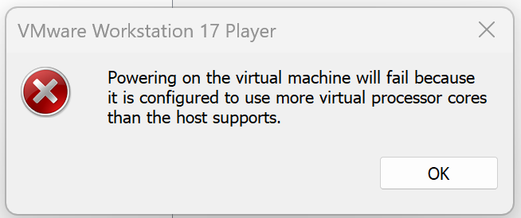
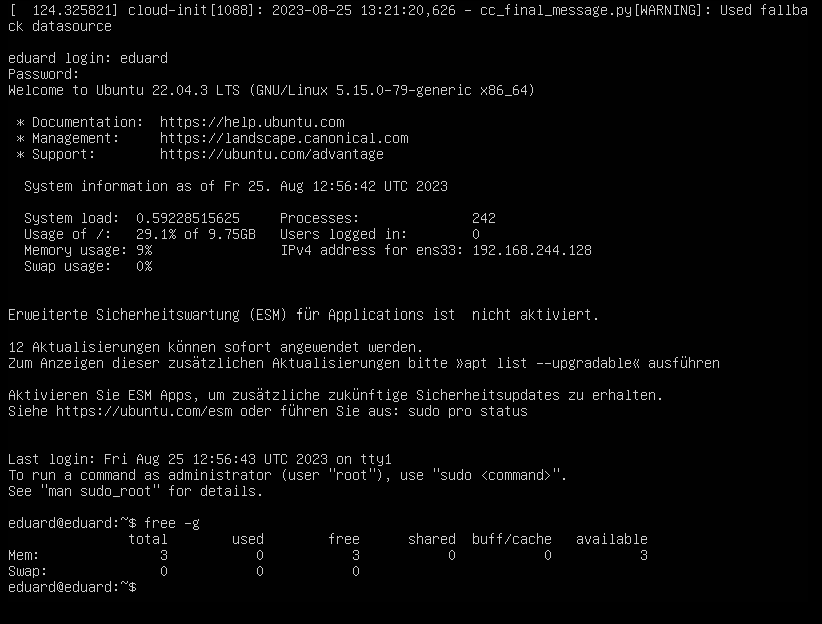
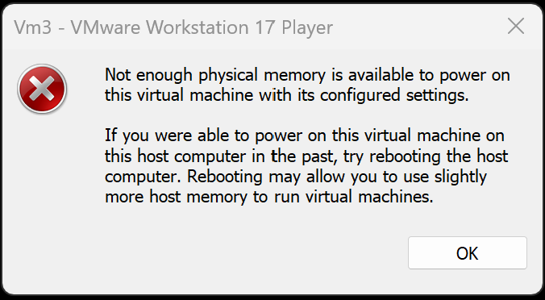

# Kn01

### Weniger CPUs als das Host-System

### Mehr CPUs als das Host-System

### Weniger RAM als das Host-System

### Mehr RAM als das Host-System

### Weshalb tretten solche Fehler auf?
VMware Workstation Player 17 ermöglicht das Ausführen mehrerer Betriebssysteme auf einem einzelnen Host-System durch Virtualisierung. Dabei teilen sich die virtuellen Maschinen die verfügbaren Ressourcen wie RAM und Prozessoren mit dem Host-System. Die Menge an RAM und Prozessoren, die den virtuellen Maschinen zugewiesen werden können, ist durch die physischen Ressourcen des Host-Systems begrenzt. Überbeanspruchung kann zu Leistungsproblemen führen. Es ist wichtig, die Ressourcenzuweisungen im Einklang mit den Host-Systemkapazitäten zu halten, da das Betriebssystem des Hosts die Verteilung überwacht, um optimale Leistung sicherzustellen. Es ist nicht möglich, den virtuellen Maschinen mehr Ressourcen zuzuweisen, als das Host-System bereitstellen kann.