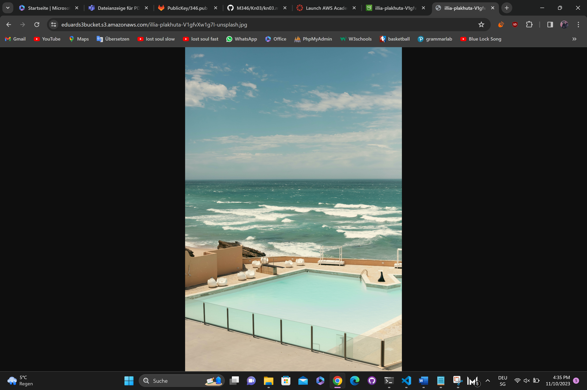
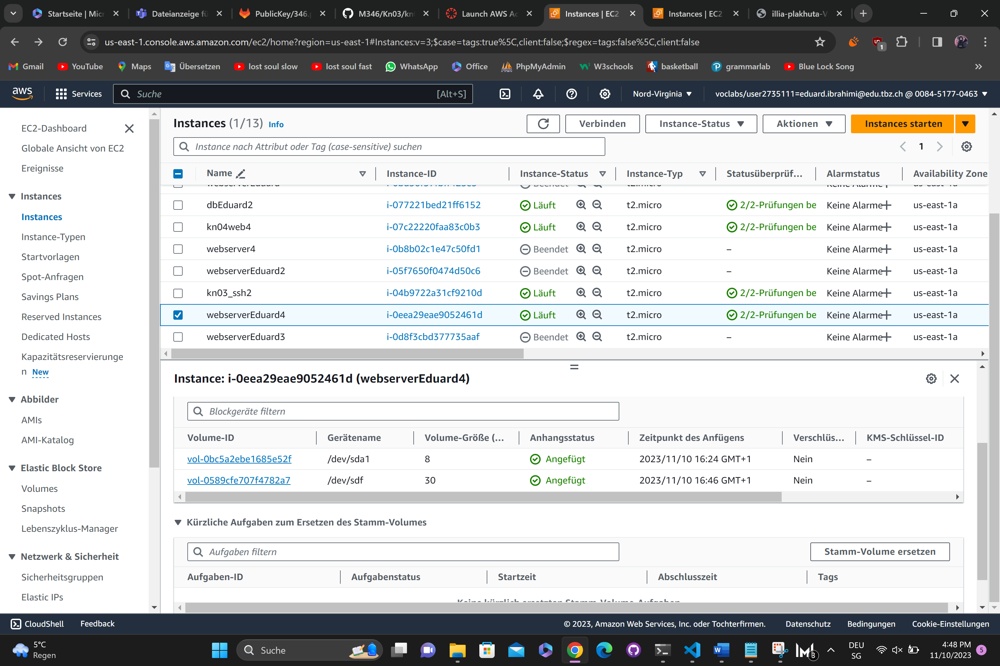

# Ueb04

## Aufgabe_A

### 1

### 2


## Aufgabe_B

```
#cloud-config
users:
  - name: ubuntu
    sudo: ALL=(ALL) NOPASSWD:ALL
    groups: users, admin
    home: /home/ubuntu
    shell: /bin/bash
    ssh_authorized_keys:
      - ssh-rsa AAAAB3NzaC1yc2EAAAADAQABAAABAQCAUA/YPKxRr+vB5dNzDzg3YVVL9TRSqZ7vLuL1CWn6IfNCFU4icssWR6sOfuBIx9El7JjLbm/xYFrlSPtVAFNeccgKj69u+RHVu1QktoKrY7CtvUayhZiBRZHuTb++AXv6DvwyH+/JF9APQNy2IPwtUcmIcyyjshj4mYyQvo2suVGCiIfZASapYXcobBKSzgBQUQgXmDJiI9x0EmDPpStXLohML9hcJnujEF1VXIV5qGNWnK1PfWFa0FDrYXmqVWmTkcuPsa4yQ2e5TbSAkJS04Wnaxz41EgWVHHmcwsz2dSwQ8SM4sFQVPkwEHaPdhgtOX1RUDckTcZBm+eJADBZL Ahmadpub1
disable_root: false
package_update: true
packages:
  - curl
  - wget
  - apache2
  - php
  - libapache2-mod-php

write_files:
  - content: |
      <?php phpinfo(); ?>
    path: /var/www/html/info.php
    permissions: "0644"
    # Ab hier wird das gesuchte PHP-File erstellt
  - content: |
      <?php
      $ihrname = "Eduard";
      ?>
      <html>
      <head>
      <title><?php echo $ihrname; ?></title>
      </head>
      <body>
      <h1>KN04</h1>
      <br />
      
      </body>
      </html>

    path: /var/www/html/test.php
    permissions: "0644"
runcmd:
  - sudo systemctl restart apache2
```

### 1


## Aufgabe_C
### 1



## Aufgabe_D
#### EBS Root:
Typ: Hot
Persistenz: Nein
Begründung: Das Betriebssystem ist ständig im Einsatz, da es für den reibungslosen Betrieb des Systems erforderlich ist. Es zeigt keine hohe Persistenz, da es gleichzeitig mit einer Instanz gelöscht wird, wenn diese Instanz gelöscht wird.

#### EBS Zusätzliches Volumen:
Typ: Hot
Persistenz: Ja
Begründung: Es wird als "Hot" betrachtet, da es zusätzliche Elemente zum EBS Root darstellt, welches das Betriebssystem enthält. Es zeichnet sich durch Persistenz aus, da die Volumen nicht gelöscht werden.

#### S3:
Typ: Warm
Persistenz: Ja
Begründung: Die Bezeichnung "Warm" trifft zu, da das Bild gelegentlich aufgerufen wird. Es zeigt Persistenz, da das Bild weiterhin existiert, solange es nicht gelöscht wird.