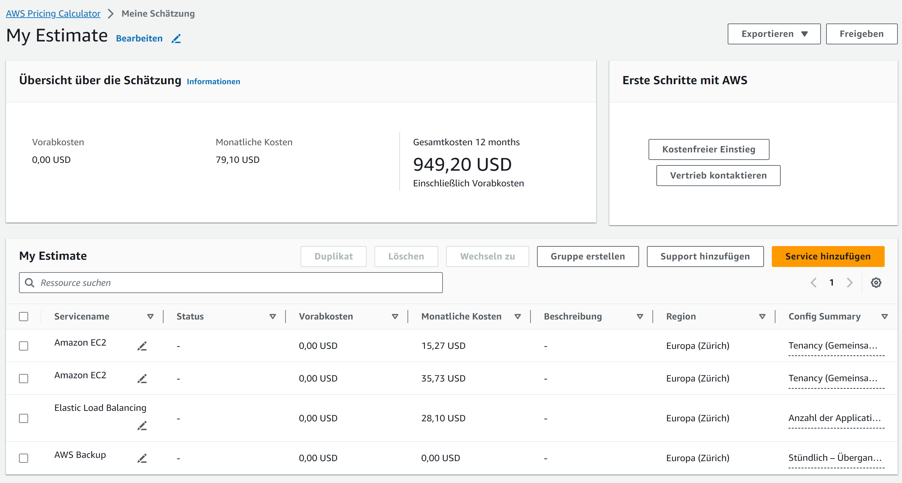
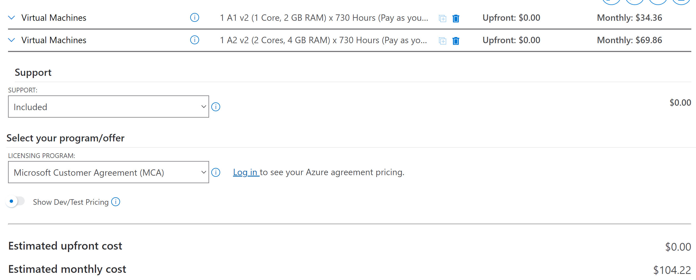
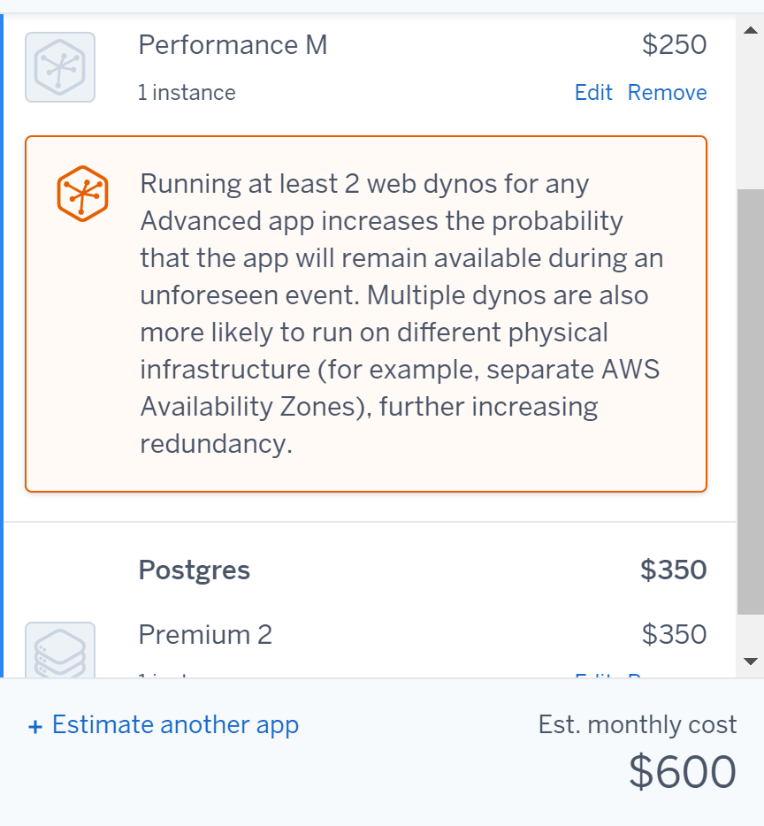
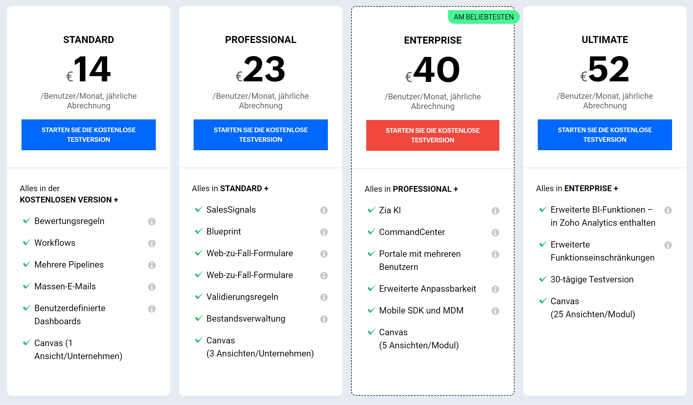
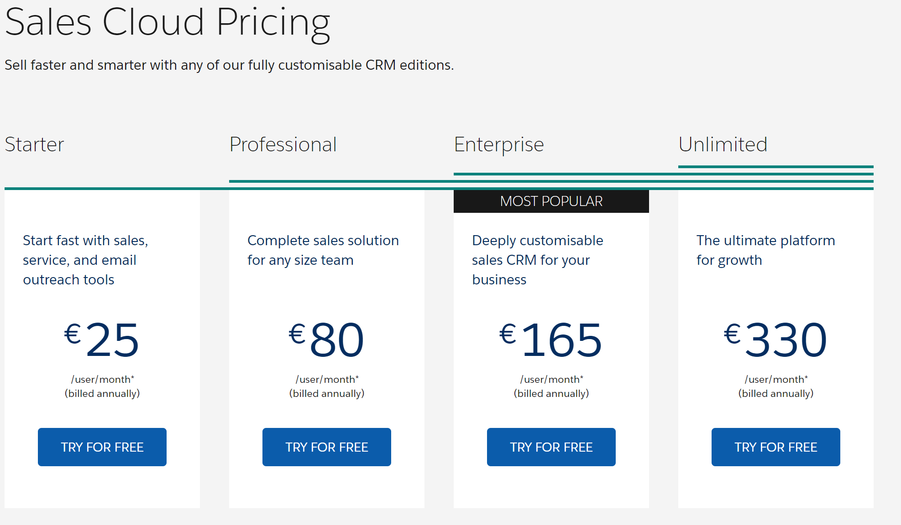

## KN_07

**A)**

### AWS und Azure
1. 

Ich habe 1 Web Server mit 1 Core, 20GB Speicher, 2 GB RAM, Ubuntu Pro ausgewählt. Den Rest habe ich auf Default gelassen. Bei Load Balancing habe ich "Load Balancer on Outposts" ausgewählt. Bei Backup habe ich einmal täglich für die letzten 7 Tage, wöchentlich für den letzten Monat und monatlich für die letzten drei Monate ausgewählt.

Ich habe auch das Gleiche für die Datenbank (DB) gemacht: 1 DB Server mit 2 Cores, 100GB Speicher, 4 GB RAM, Ubuntu.
 

Bei Azure habe ich alles genauso gemacht, außer dass ich nicht selbst die genauen Core, Speicher und RAM-Werte angegeben habe.

 

### Heroku
1. 

1. 

**Zoho CRM und Salesforce**

Zoho ist kosteneffizient für ein Unternehmen mit 16 Mitarbeitern und zeichnet sich durch Benutzerfreundlichkeit und schnelle Implementierung aus.

Salesforce Sales Cloud ist äußerst skalierbar und kann mit dem Wachstum Ihres Unternehmens Schritt halten. Es bietet eine breite Palette von Funktionen und Integrationen, die für größere Unternehmen geeignet sind.

**SaaS**
Einfache Nutzung, schnelle Implementierung, geringer Wartungsaufwand, keine Hardwareverwaltung erforderlich.

**IaaS**
Volle Kontrolle über die Infrastruktur, Skalierbarkeit, anpassbare Umgebung.

**PaaS**
Entwicklungsplattformen für die Anwendungsentwicklung, automatisierte Skalierung und Verwaltung.

**Gegenüberstellung**
Für ein kleines Unternehmen wie in der Aufgabe gestellt, das hauptsächlich CRM benötigt, ist die Nutzung von SaaS die praktikabelste und kosteneffizienteste Option. IaaS und PaaS sind in diesem Fall wahrscheinlich überdimensioniert und würden unnötige Komplexität und Kosten hinzufügen.

**B)**

**1. Wie stark unterscheiden sich die Angebote?**
Salesforce Sales Cloud bietet im Vergleich zu Zoho CRM eine breitere Palette von Funktionen und Integrationen.

Salesforce Sales Cloud ist in der Regel besser skalierbar.

Salesforce Sales Cloud ist im Vergleich zu Zoho CRM teurer.

**2. Welches ist das billigste?**
In der Regel ist Zoho CRM billiger als Salesforce Sales Cloud, aber dies hängt von verschiedenen Faktoren ab, einschließlich der Anzahl der Benutzer und der benötigten Funktionen.

**3. Warum ist eines davon viel teurer? Ist es jedoch wirklich teurer?**

Die höheren Kosten von Salesforce können gerechtfertigt sein, wenn Sie die erweiterten Funktionen, die Skalierbarkeit und die Integrationen benötigen, die es bietet. Es ist wichtig zu überlegen, ob diese zusätzlichen Funktionen und die Skalierbarkeit den höheren Preis rechtfertigen, oder ob Zoho CRM für Ihre Bedürfnisse ausreichend ist.
